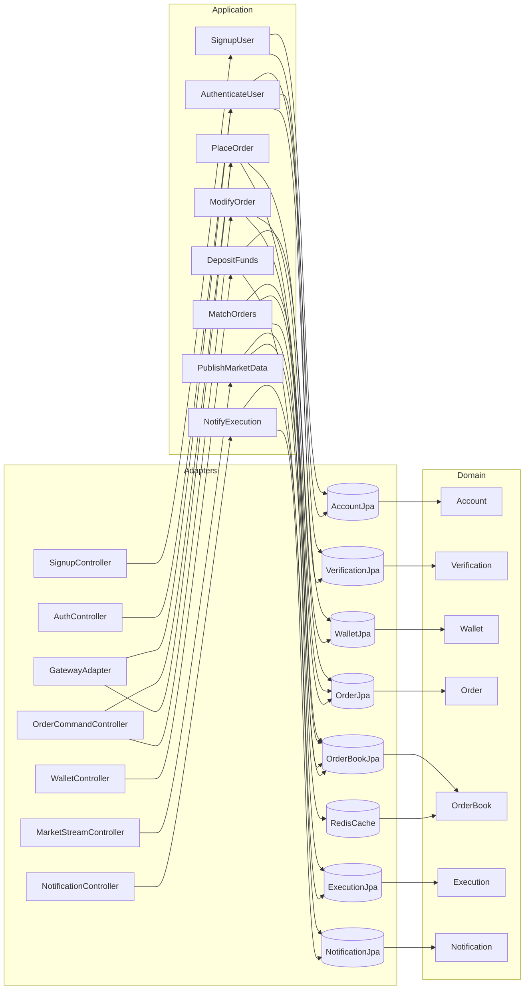
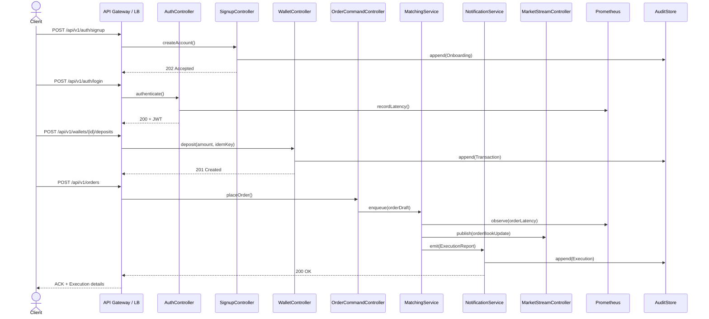

# BrokerX – Documentation d'Architecture (Arc42) – Remise finale

Ce document applique le gabarit Arc42 pour décrire la phase 2 du projet BrokerX+. Elle s’appuie sur le cahier des charges LOG430 2025.3 et prolonge le socle monolithique de la phase 1 vers une API REST publique instrumentée, prête pour la montée en charge (load balancing, caching) et l’orchestration par une API Gateway.

## 1. Introduction et objectifs
### Panorama métier
BrokerX+ est une plateforme de courtage destinée aux investisseurs particuliers. La phase 2 doit livrer un socle REST complet couvrant l’onboarding (KYC/MFA), les services de portefeuille, le trading bout-en-bout (placement, cancel/replace, matching, notifications) ainsi que la diffusion de données de marché temps réel. L’architecture doit démontrer des gains mesurés avec les 4 Golden Signals et préparer la migration vers des microservices orchestrés par une API Gateway.

### Portée de la documentation
Ce document suit le modèle Arc42. Les diagrammes PlantUML se trouvent dans `../views/` (génération PNG : `plantuml *.puml`). Les éléments essentiels sont réunis pour permettre à un nouvel arrivant de comprendre, lancer et déployer le prototype en moins de 30 minutes (voir le `README.md` racine et `../deploy/README.md`).

### Parties prenantes
- **Clients** : investisseurs de détail (web/mobile).
- **Opérations Back-Office** : suivi des règlements et supervision.
- **Conformité & Risque** : application des contrôles KYC/AML et pré-/post-trade.
- **Fournisseurs de données** : diffusion temps réel des cotations simulées.

### Objectifs qualité prioritaires
| Priorité | Objectif | Cible Phase 2 |
|----------|----------|---------------|
| 1 | **Performance & Scalabilité** | Latence P95 ≤ 250 ms via API Gateway, ≥ 500 ordres/s en régime nominal, capacité à scaler 1→4 instances. |
| 2 | **Disponibilité** | ≥ 99 % (environnement labo) avec tolérance aux pannes (kill d’une instance), redémarrage < 2 min. |
| 3 | **Sécurité & Conformité** | MFA obligatoire, audit trail append-only, politique exactly/effectively-once sur ordres/dépôts, durcissement JWT. |
| 4 | **Observabilité** | Logs structurés corrélés (traceId), métriques Prometheus (Golden Signals), dashboards Grafana, alertes de seuil. |
| 5 | **Traçabilité documentaire** | Arc42/4+1 à jour, ≥3 ADR (style, persistance, erreurs+audit), API contractuelle (OpenAPI v1). |

## 2. Contraintes
| Contrainte | Description |
|------------|-------------|
| Langages serveur privilégiés | JVM (Java/Kotlin) conforme aux politiques INF110, frameworks Spring Boot. |
| Architecture | Monolithe hexagonal exposant une API REST versionnée, extensible vers microservices + API Gateway (Kong/KrakenD/SCG). |
| Données | Idempotence stricte (dépôts, ordres), audit immuable, schémas gérés par migrations reproductibles. |
| Observabilité | Instrumentation obligatoire (Prometheus, Grafana), collecte des 4 Golden Signals, scripts de charge k6/JMeter. |
| Sécurité & conformité | MFA, chiffrement au repos, gestion des secrets via env/secret store, audit KYC/AML, conservation réglementaire. |

## 3. Contexte et portée
### Diagramme de contexte
```mermaid
flowchart LR
    subgraph Clients
        Trader[Client (Web)]
        BackOffice[Back-Office]
    end
    subgraph Monolithe BrokerX
        Accounts[Client & Comptes]
        Portfolio[Portefeuilles & Positions]
        Orders[Ordres & Appariement]
        Market[Données de marché]
        Notify[Notifications & Confirmations]
        Compliance[Conformité]
    end
    MarketFeed[Fournisseur de données simulé]
    Payment[Service de paiement simulé]

    Trader -->|Inscription / Connexion| Accounts
    Trader -->|Consultation / Dépôts| Portfolio
    Trader -->|Ordres| Orders
    Trader -->|Flux marché| Market
    Trader -->|Notifications| Notify

    BackOffice -->|Supervision| Compliance
    BackOffice -->|Administration comptes| Accounts

    MarketFeed --> Market
    Payment --> Portfolio
    Orders --> Portfolio
    Orders --> Notify
    Compliance --> Notify
```

### Portée fonctionnelle
- Gestion des comptes clients (inscription, MFA, statuts).
- Approvisionnement virtuel et tenue de portefeuille.
- Soumission, modification, annulation et appariement interne des ordres.
- Diffusion de données marché simulées et notifications d’exécution.

### Diagramme de cas d’utilisation (vue Scénarios)
```mermaid
usecaseDiagram
  actor Client
  actor "Service Paiement" as Payment
  actor "Fournisseur Marché" as MarketFeed
  actor "Back-Office" as BackOffice
  rectangle BrokerXPlus {
    usecase UC01 as "UC-01 Inscription & KYC"
    usecase UC02 as "UC-02 Authentification & MFA"
    usecase UC03 as "UC-03 Dépôt virtuel"
    usecase UC04 as "UC-04 Abonnement données marché"
    usecase UC05 as "UC-05 Placer un ordre"
    usecase UC06 as "UC-06 Modifier / Annuler"
    usecase UC07 as "UC-07 Matching interne"
    usecase UC08 as "UC-08 Notifications & Audit"
  }
  Client --> UC01
  Client --> UC02
  Client --> UC03
  Client --> UC04
  Client --> UC05
  Client --> UC06
  UC03 --> Payment : confirmation
  UC04 <-- MarketFeed : flux temps réel
  UC05 --> UC07
  UC07 --> UC08
  BackOffice --> UC08
```

## 4. Architecture de solution
- **Style** : Monolithe hexagonal exposant une API REST `v1` sécurisée (OpenAPI/Swagger) et instrumentée. Les ports permettent d’introduire une API Gateway, un moteur de matching isolable et des adaptateurs cache/load balancer sans impacter le domaine.
- **Couches** :
  - **Domaine** : agrégats `Account`, `Verification`, `Wallet`, `Order`, `OrderBook`, `Execution`, `Notification`, invariants pré-trade.
  - **Application** : services orchestrant les UC (onboarding, trading, matching, notifications) et publiant des événements internes.
  - **Infrastructure** : adaptateurs REST (`/api/v1/**`), SSE/WebSocket pour marché, persistance relationnelle (PostgreSQL), cache/queue (Redis), instrumentation (Prometheus, Grafana), et intégration API Gateway/LB (Traefik/NGINX).
- **Flux clefs** :
  1. Onboarding : inscription → vérification OTP → activation → audit trail.
  2. Trading : dépôt → placement ordre → matching → confirmation → notification multi-canal.
  3. Observabilité : instrumentation de chaque UC (logs corrélés, métriques latence/RPS, traces) et export vers dashboards.
  4. Opérations : scripts de charge (k6) comparant monolithe direct vs API Gateway/load balancer, collecte des Golden Signals.

### Bounded contexts (DDD)
| Contexte | Responsabilités principales | Entités / Agrégats | Interfaces sortantes |
|----------|----------------------------|---------------------|----------------------|
| Onboarding & Conformité | Inscription, capture KYC/AML, vérification MFA, workflow `Pending → Active`, audit onboarding. | Account, VerificationRequest, MFAFactor, Session | Email/SMS, service OTP, audit trail |
| Comptes & Sessions | Gestion des identités, MFA step-up, sessions JWT/opaque, politiques de verrouillage. | AccountCredentials, AccountSession | API Gateway (auth), Observabilité (trace). |
| Portefeuilles & Positions | Soldes cash/titres, réservations, journal comptable append-only, idempotence dépôts. | Wallet, Position, TxJournal, Reservation | Service paiement simulé, reporting. |
| Marché temps réel | Publication des cotations/carnets, back-pressure, modes dégradés. | MarketSubscription, MarketTick, OrderBookSnapshot | WebSocket/SSE, cache Redis, Prometheus métriques. |
| Ordres & Matching | Commande/validation, cancel/replace, priorités prix/temps, matching interne. | Order, OrderVersion, OrderBook, Execution, PreTradeRule | Notifications, portefeuille, API Gateway. |
| Notifications & Audit | Publication ExecutionReport, envoi multi-canal (UI push, email), audit immuable. | NotificationEnvelope, ExecutionAudit | Email/Webhook, bus interne, observabilité. |

### Langage ubiquitaire (extrait)
| Terme | Définition (Phase 2) | Contexte |
|-------|----------------------|----------|
| VerificationRequest | Dossier KYC avec preuves chiffrées, horodatées, statut `PENDING/APPROVED/REJECTED`. | Onboarding & Conformité |
| SessionToken | Jeton JWT/opaque signé, corrélé à un `traceId`, supporte step-up MFA. | Comptes & Sessions |
| Reservation | Blocage temporaire de cash/titres aligné sur la quantité restante d’un ordre (`remainingQty`). | Portefeuilles & Positions, Ordres |
| OrderVersion | Représente une révision d’un ordre (`version`, `clientOrderId`), utilisée pour cancel/replace. | Ordres & Matching |
| ExecutionReport | Événement détaillé (`fillQty`, `fillPrice`, `fees`, `executionId`) déclenchant notifications et settlement. | Ordres & Matching, Notifications & Audit |
| MarketTick | Message temps réel (bid/ask, top-of-book, volume) avec latence mesurée (`tickLatencyMs`). | Marché temps réel |
| NotificationEnvelope | Charge utile normalisée (`type`, `channel`, `payload`, `traceId`) envoyée vers UI/email/webhook. | Notifications & Audit |

### Modele de domaine
Le diagramme de classe `../views/domain-model.puml` illustre les agregats principaux (`CompteClient`, `Portefeuille`, `Ordre`) et leurs relations.

### Vue logique (4+1 – Logical)


### Vue processus (4+1 – Process)


### Vue déploiement (4+1 – Deployment)
```mermaid
graph TB
  subgraph DockerHost
    subgraph ComposeStack
      API[brokerx-api (Spring Boot)]
      DB[(PostgreSQL 16)]
      Cache[(Redis 7)]
      Prometheus[(Prometheus)]
      Grafana[(Grafana)]
      Gateway[(API Gateway - Kong/KrakenD)]
      LB[(Traefik/NGINX)]
      K6[k6 Runner]
    end
  end
  Client(((Clients / QA))) --> LB
  LB --> Gateway
  Gateway --> API
  API -- JDBC --> DB
  API -- Redis --> Cache
  API -- Metrics --> Prometheus
  Prometheus --> Grafana
  K6 --> LB
  Gateway -- health --> |/status| API
  DB -- health --> |pg_isready| DB
  Cache -- health --> |PING| Cache
  Grafana -- dashboards --> Ops
```

### Vue développement (4+1 – Development)
```mermaid
flowchart LR
  subgraph adapters-web
    AW1[SignupController]
    AW2[AuthController]
    AW3[WalletController]
    AW4[OrderCommandController]
    AW5[OrderQueryController]
    AW6[MarketStreamController]
    AW7[NotificationController]
    AWS1[RequestLoggingFilter]
    AWS2[GlobalExceptionHandler]
    AWS3[GatewayConfig]
  end
  subgraph adapters-infra
    AI1[Persistence (JPA)]
    AI2[RedisCacheAdapter]
    AI3[PrometheusMetrics]
    AI4[GrafanaDashboards]
    AI5[NotificationAdapter]
  end
  subgraph application
    UC1[SignupUser]
    UC2[AuthenticateUser]
    UC3[DepositFunds]
    UC4[PlaceOrder]
    UC5[ModifyOrder]
    UC6[MatchOrders]
    UC7[PublishMarketData]
    UC8[NotifyExecution]
  end
  subgraph domain
    DM1[Account]
    DM2[Verification]
    DM3[Wallet]
    DM4[Order]
    DM5[OrderBook]
    DM6[Execution]
    DM7[Notification]
  end
  adapters-web --> application
  application --> adapters-infra
  adapters-infra --> domain
```

## 5. Perspectives de qualité
| Qualité | Stratégie Phase 2 |
|---------|-------------------|
| Performance & Scalabilité | Benchmarks k6/JMeter (scénarios UC-01→UC-08) comparant N=1,2,3,4 instances, cache Redis pour endpoints coûteux, compression HTTP. |
| Disponibilité | Déploiement Compose avec LB + Gateway + probes ; exercices chaos (kill d’une instance en charge) ; runbook de reprise <2 min. |
| Sécurité & Conformité | MFA obligatoire, hashage BCrypt, JWT signé/roté, audit append-only, ADR conformité exactly/effectively-once, durcissement des rôles. |
| Observabilité | Micrometer Prometheus + dashboards Grafana (Golden Signals, matching, notifications), export traces (OpenTelemetry optionnel), alertes seuils (cf. ADR-005). |
| Maintenabilité | Modules hexagonaux découplés, contrats OpenAPI versionnés, ADRs documentant évolutions (style, persistance, erreurs/audit, observabilité). |

### Tests & Qualité
- Pyramide revue : unit (onboarding, matching, notifications), intégration (PostgreSQL + Redis Testcontainers), contrats API (Spring Cloud Contract), tests E2E (RestAssured) et tests de charge (k6).
- Couverture ciblée ≥85 % sur use cases métier, Sonar/Spotless dans la pipeline CI.
- Stratégie complète documentée dans `../tests/test-strategy.md` (scénarios Golden Signals, script k6, collecte métriques).

### Sécurité & observabilité applicatives
- Gestion d’erreurs normalisée (`GlobalExceptionHandler`) incluant `traceId`, `errorCode`, `correlationId`.
- Validation d’entrées accrue (`@Pattern`, `@Size`, `@Email`), sanitation côté API Gateway (CORS, rate-limit).
- Authentification stateless par jeton JWT (`Authorization: Bearer`) émis lors du login MFA (`/api/v1/auth/login`) ; le back-end vérifie la possession du compte avant dépôt ou ordre.
- CORS centralisé (`http://localhost:3000`, `8081`, `8085`) avec rejet explicite en cas de mismatch.
- Logs JSON corrélés (traceId/userId/UC) envoyés vers stack observabilité (Grafana/Loki optionnel).
- Secrets via variables d’environnement et support secret store (Vault/1Password) ; rotation clés JWT documentée.
- Documentation OpenAPI disponible via `http://localhost:8085/v3/api-docs` et Swagger UI (`/swagger-ui/index.html`) exportable pour la Gateway/contrats.
- Contrat OpenAPI exporté dans `docs/api/brokerx-openapi.json` (snapshot du endpoint `/v3/api-docs`, versionné pour la remise et importable dans Postman/SwaggerHub). La collection Postman associée est fournie dans `docs/api/BrokerX.postman_collection.json` (variable `base_url` pointant par défaut vers `http://localhost:8081`).
- Cache Redis TTL 60 s sur les vues GET `/api/v1/orders/{id}/executions|notifications`, invalidé par le matching/notifications via `OrderCacheService`; les métriques `cache.*` exposent hits/misses pour mesurer les gains.
- Metrics Prometheus exposées via `/actuator/prometheus` avec les compteurs `brokerx_orders_accepted_total`, `brokerx_matching_duration_seconds`, `brokerx_matching_executions_total`, `brokerx_matching_qty`, `brokerx_notifications_total`; dashboards Golden Signals pré-provisionnés (`docs/architecture/observability/grafana-golden-signals.json`) et scripts de charge `tests/perf/orders-matching.js`.
- Prometheus (`http://localhost:9090`) et Grafana (`http://localhost:3000`) sont inclus dans la stack Compose, configurés automatiquement (datasource + dashboard) pour analyse continue.

## 6. Risques et dettes
| Risque | Impact | Mitigation |
|--------|--------|------------|
| Saturation matching sous forte charge | Latence > P95 cible, rejets utilisateurs | Benchmarks réguliers k6, optimisation order book, mise en cache lecture. |
| Panne Redis/cache | Perte de performance/canales notifications | Fallback en mémoire + surveillance Redis (`PING`), procédure de redémarrage. |
| API Gateway indisponible | Interruption service public | HAProxy/Traefik en secours, scripts de bascule directe, health-checks agressifs (cf. ADR-006). |
| Données marché stales | Décisions erronées | Mode dégradé, bannière UI, monitoring latence `tickLatencyMs`. |
| Conformité (audit incomplet) | Risque réglementaire | ADR conformité, audit append-only signé, jobs de vérification quotidiens. |

## 7. Décisions architecturales
Les décisions structurantes sont consignées dans `../adr/` :
- **ADR-001** : Monolithe hexagonal & séparation ports/adapters.
- **ADR-002** : Persistance relationnelle + idempotence sur dépôts/ordres.
- **ADR-003** : Gestion d’erreurs/version interne & journalisation structurée.
- **ADR-004** : Conformité & audit exactly-once/effectively-once (journal immuable, corrélation traceId).
- **ADR-005** : Observabilité avancée (Micrometer, Prometheus, Grafana, Golden Signals).
- **ADR-006** : API Gateway, load balancing et sécurité périmétrique.

## 8. Scénarios et cas d’utilisation
### Priorisation MoSCoW
| Identifiant | Titre | Priorité | Justification |
|-------------|-------|----------|---------------|
| UC-01 | Inscription & vérification d’identité | Must | Condition préalable aux activités de trading, exigences KYC/AML. |
| UC-02 | Authentification & MFA | Must | Sécurise l’accès aux comptes et protège les opérations sensibles. |
| UC-03 | Approvisionnement du portefeuille | Must | Garantit des fonds disponibles pour les ordres d’achat. |
| UC-04 | Abonnement aux données de marché | Should | Aide à la décision mais non critique pour exécuter un ordre. |
| UC-05 | Placement d’un ordre (marché/limite) | Must | Cœur métier de la plateforme. |
| UC-06 | Modification / annulation d’un ordre | Must | Offre flexibilité et réduit le risque d’exécution non désirée. |
| UC-07 | Appariement interne & exécution | Must | Transforme les ordres en transactions réelles. |
| UC-08 | Confirmation d’exécution & notifications | Must | Obligation réglementaire de confirmation et traçabilité. |
| UC-09 | Routage vers marchés externes simulés | Could | Prévu pour les phases ultérieures (interopérabilité). |
| UC-10 | Rapports de fin de journée & audit avancé | Could | Valeur ajoutée mais hors périmètre MVP. |
| UC-11 | Détection d’activités suspectes | Won’t (phase 1) | Nécessite une architecture événementielle future. |

### UC Must (scénarios textuels)
#### UC-01 – Inscription & vérification d’identité
- **Acteurs** : Client (principal), service d’email/SMS (secondaire).
- **Préconditions** : aucune.
- **Postconditions (succès)** : compte `Active`, audit enrichi (horodatage, empreinte docs).
- **Flux principal** :
  1. Le client saisit identifiant, mot de passe et données KYC (nom, adresse, date de naissance).
  2. Le système valide les données, crée un compte `Pending` et envoie un OTP ou lien de vérification.
  3. Le client confirme le lien/OTP avant expiration.
  4. Le système active le compte (`Active`), journalise l’événement et notifie le client.
- **Scénarios alternatifs** :
  - A1 : OTP non confirmé → compte reste `Pending`, rappel + expiration automatique.
  - E1 : Email/téléphone déjà utilisés → rejet avec orientation récupération de compte.
  - E2 : Données KYC invalides → rejet explicite et instructions.

#### UC-02 – Authentification & MFA
- **Préconditions** : compte `Active`.
- **Postconditions (succès)** : session établie, jeton de connexion, audit (IP, device).
- **Flux principal** :
  1. Le client saisit identifiant/mot de passe.
  2. Le système vérifie les crédentiels et applique anti-brute-force / réputation IP.
  3. Si MFA requise, un OTP (TOTP/SMS/WebAuthn) est envoyé.
  4. Le client fournit l’OTP valide.
  5. Le système délivre le jeton de session et enregistre l’authentification.
- **Scénarios alternatifs** :
  - A1 : Appareil de confiance → step-up MFA sollicité uniquement pour actions sensibles.
  - E1 : Trois OTP erronés → verrouillage temporaire.
  - E2 : Compte suspendu → accès refusé, contact support.

#### UC-03 – Approvisionnement du portefeuille (dépôt virtuel)
- **Préconditions** : compte `Active`, portefeuille initialisé.
- **Postconditions (succès)** : solde créditeur, écriture comptable append-only, notification.
- **Flux principal** :
  1. Le client saisit montant et identifiant idempotent (clientRequestId).
  2. Le système vérifie les limites (min/max, anti-fraude) et crée une transaction `Pending`.
  3. Le service de paiement simulé confirme (`Settled`).
  4. Le système crédite le portefeuille, journalise le mouvement et notifie le client.
- **Scénarios alternatifs** :
  - A1 : Confirmation asynchrone → reste `Pending` jusqu’à réception, puis crédit.
  - E1 : Paiement rejeté → transaction `Failed`, message explicite.
  - E2 : Re-soumission avec même idempotency key → renvoi du résultat initial.

#### UC-05 – Placement d’un ordre (marché/limite)
- **Préconditions** : session valide, portefeuille créditeur, instrument éligible.
- **Postconditions (succès)** : ordre `Accepted/Working`, réservations de fonds ou titres mises à jour.
- **Flux principal** :
  1. Le client fournit symbole, sens, type (marché/limite), quantité, prix (si limite), durée (DAY/IOC/FOK) et `clientOrderId`.
  2. Le système normalise la requête, horodate en UTC et persiste pour audit.
  3. Contrôles pré-trade : pouvoir d’achat/marge, bandes de prix, interdictions short-sell, limites utilisateur, cohérence.
  4. En cas de succès, le système réserve les montants nécessaires, attribue un `OrderID` et envoie un ACK.
  5. L’ordre est injecté dans le moteur d’appariement interne.
- **Scénarios alternatifs** :
  - A1 : Ordre marché → pas de prix requis, routage immédiat.
  - A2 : IOC/FOK → logique spécifique dans l’étape d’appariement.
  - E1 : Pouvoir d’achat insuffisant → rejet motivé.
  - E2 : Violation bande de prix / tick size → rejet immédiat.
  - E3 : Duplication `clientOrderId` → renvoi de la réponse initiale (idempotence).

#### UC-06 – Modification / annulation d’un ordre
- **Préconditions** : ordre existant, non entièrement exécuté.
- **Flux principal** :
  1. Le client émet une requête Cancel ou Replace (quantité/prix).
  2. Le système verrouille l’ordre (optimiste/pessimiste) et vérifie l’état courant.
  3. Pour Replace, les contrôles pré-trade sont rejoués ; pour Cancel, l’ordre est retiré.
  4. Le système renvoie Cancel/Replace ACK et met à jour les réservations.
- **Scénarios alternatifs** :
  - A1 : Exécution partielle concurrente → seule la quantité résiduelle est modifiable.
  - E1 : Ordre déjà exécuté/annulé → rejet avec état courant.
  - E2 : Conflit de version → invitation à rejouer avec la dernière révision.

#### UC-07 – Appariement interne & exécution
- **Préconditions** : carnet maintenu (priorité prix/temps).
- **Flux principal** :
  1. Le moteur insère l’ordre entrant dans le carnet approprié (achat/vente).
  2. Il recherche les contreparties prioritaires et génère des exécutions (fills) partielles ou totales.
  3. Le système met à jour les quantités restantes et publie des `ExecutionReport`.
  4. Mise à jour du top-of-book et diffusion aux abonnés marché.
- **Scénarios alternatifs** :
  - A1 : Ordre marché sans liquidité → exécution partielle, reliquat reste `Working` ou annulé (IOC/FOK).
  - E1 : Incohérence détectée dans le carnet → rollback local et alerte opérations.

#### UC-08 – Confirmation d’exécution & notifications
- **Préconditions** : `ExecutionReport` généré.
- **Flux principal** :
  1. Le système met à jour l’état de l’ordre (Partial/Filled/Rejected).
  2. Il crée une confirmation avec détails (prix, quantité, frais) et journalise l’audit.
  3. Notifie le client (UI push + email de fallback).
- **Scénarios alternatifs** :
  - A1 : Agrégation de multiples fills avant notification.
  - E1 : Notification temps réel échoue → retry puis email de secours.

---

Les sections précédentes synthétisent les vues Arc42/4+1 pour la phase 2 ; les diagrammes détaillés (PlantUML) restent versionnés dans `../views/`.
# Stratégie de tests – Phase 2

| Niveau | Objectif | Couverture / artefacts |
|--------|----------|------------------------|
| **Unit** | Garantir les invariants métier (onboarding, matching, notifications) sans IO. | Tests JUnit/Mockito sur `SignupUser`, `AuthenticateUser`, `MatchOrders`, `NotifyExecution`. |
| **Intégration** | Vérifier transactions/idempotence contre PostgreSQL + Redis, contrats REST. | `*IntegrationTest` (Testcontainers Postgres/Redis), Spring Cloud Contract (`contracts/`). |
| **E2E** | Valider les parcours clés via l’API REST (`signup → login → dépôt → ordre → execution`). | Tests RestAssured (`ScenarioE2ETest`), collection Postman automatisable. |
| **Performance** | Mesurer Golden Signals sous charge, comparer direct API vs Gateway (N=1..4). | Scripts k6 (`tests/perf`), profils `load-single.json`, `load-gateway.json`. |
| **Observabilité** | Garantir métriques/logs exploitable & dashboards cohérents. | Tests de smoke Prometheus/Grafana (`tests/observability/`), vérification latence P95. |

- Couverture cible ≥85 % sur les cas métiers critiques ; rapports JaCoCo générés lors de `mvn verify` (`target/site/jacoco/index.html`).
- La pipeline CI déclenche : lint (Spotless) → unit → intégration (Postgres/Redis) → contrats → build image → smoke k6 → publication artefacts + badge.
- La pipeline CI (`.github/workflows/ci.yml`) s'exécute sur GitHub Actions : checkout, JDK 21, `mvn -B verify`, puis export du rapport JaCoCo en artefact. Elle sert de point de départ pour ajouter linting, build image et scénarios k6.
- Les scénarios de charge enregistrent latence, RPS, erreurs, saturation pour comparer : monolithe direct, monolithe derrière LB, monolithe via Gateway.
- Dashboard Grafana `GoldenSignals.json` et rapport k6 `tests/perf/reports/` documentent les gains attendus (<250 ms P95, 500 ordres/s).

# Déploiement & exploitation – Remise finale

## Pré-requis
- Docker & Docker Compose (v2)
- JDK 21 + Maven (développement local)
- Node.js optionnel (génération scripts k6)

## Lancer la stack complète
```bash
cd brokerx
./scripts/deploy.sh          # build image API
docker compose up -d         # API, DB, Redis, Prometheus, Grafana, Gateway, LB
```
Pour lancer un test de charge : `docker compose run --rm k6 run tests/perf/load-gateway.js`.

## Vérifier la santé
- API : `http://localhost:8080/actuator/health` (exposé derrière Gateway).
- API Gateway : `http://localhost:8081/status`.
- Base de données : healthcheck `pg_isready`.
- Redis : healthcheck `redis-cli PING`.
- Prometheus : `http://localhost:9090/graph`.
- Grafana : `http://localhost:3000` (dashboards importés depuis `docs/architecture/observability`).

## Scénario de smoke test (direct Gateway)
```bash
# 1. Signup + validation (OTP simulé)
curl -X POST http://localhost:8081/api/v1/auth/signup \
  -H 'Content-Type: application/json' \
  -d '{"email":"demo@brokerx.dev","password":"Password!23","phone":"+15551234"}'

# 2. Login (retourne JWT)
curl -X POST http://localhost:8081/api/v1/auth/login \
  -H 'Content-Type: application/json' \
  -d '{"email":"seed@brokerx.dev","password":"password123","otp":"123456"}'

# 3. Dépôt
curl -X POST http://localhost:8081/api/v1/wallets/{walletId}/deposits \
  -H "Authorization: Bearer <token>" \
  -H 'Content-Type: application/json' \
  -d '{"amount":1000,"idempotencyKey":"demo-1"}'

# 4. Placement ordre
curl -X POST http://localhost:8081/api/v1/orders \
  -H "Authorization: Bearer <token>" \
  -H 'Content-Type: application/json' \
  -d '{"accountId":"...","symbol":"AAPL","side":"BUY","type":"MARKET","qty":10,"clientOrderId":"demo-order"}'
```
Les dashboards Grafana doivent refléter la séquence (latence, RPS, erreurs).

## Variables d’environnement clés
| Variable | Description | Par défaut `docker compose` |
|----------|-------------|------------------------------|
| `DB_URL` | URL JDBC PostgreSQL | `jdbc:postgresql://db:5432/brokerx` |
| `DB_USERNAME` | Utilisateur BD | `brokerx` |
| `DB_PASSWORD` | Mot de passe BD | `brokerx` |
| `REDIS_URL` | Endpoint Redis | `redis://redis:6379` |
| `JWT_SECRET` | Clé de signature JWT (Base64) | `changeme-in-env` |
| `PROMETHEUS_ENABLED` | Active l’export metrics | `true` |

Pour une configuration spécifique environnement : `docker compose --env-file env/prod.env up -d`.

## Microservices & routage Gateway

Le compose lance quatre instances API :

| Service | Profil Spring | Port hôte | Rôle | Route Gateway |
|---------|----------------|-----------|------|---------------|
| `api1` / `api2` | `monolith` (défaut) | `8085` | Monolithe complet pour comparaisons A/B | `/monolith/**` |
| `auth-service` | `auth` | `8086` | Authentification, inscription, MFA | `/api/v1/auth/**` |
| `portfolio-service` | `portfolio` | `8087` | Dépôts / portefeuille | `/api/v1/deposits` |
| `orders-service` | `orders` | `8088` | Commandes, cancel/replace, requêtes d’ordres | `/api/v1/orders/**` |

`spring.profiles.default` est positionné sur `monolith`, ce qui garantit la compatibilité avec les tests existants ; les microservices spécialisés sont activés via `SPRING_PROFILES_ACTIVE` dans `docker-compose.yml`.
