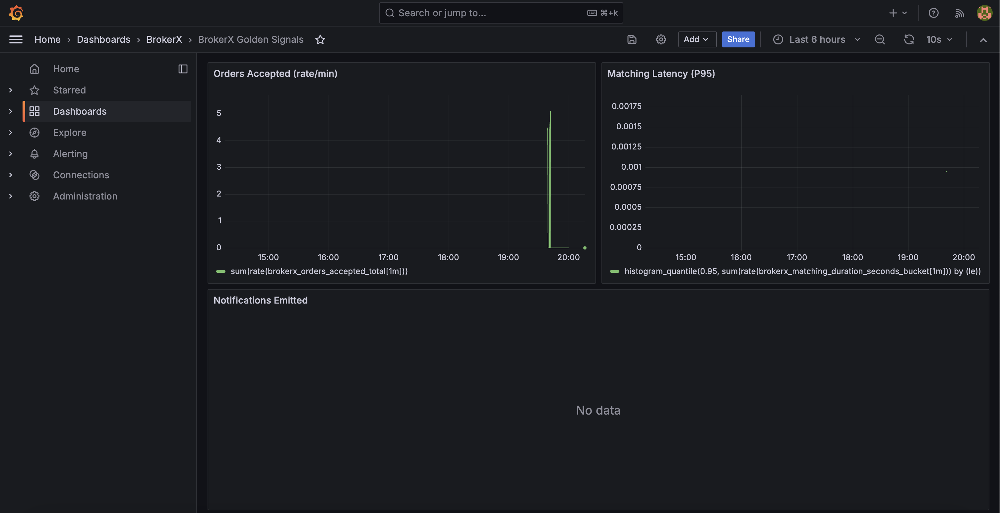

# Observabilité – Golden Signals

Le service expose désormais les métriques Prometheus via `http://localhost:8080/actuator/prometheus` et la stack Docker Compose démarre Redis, Prometheus et Grafana.

## Métriques clés

| Nom | Description | Tags |
|-----|-------------|------|
| `brokerx_orders_accepted_total` | Compte des ordres acceptés par symbole/type | `symbol`, `type` |
| `brokerx_matching_duration_seconds` | Durée du matching d'un ordre (histogramme) | `symbol`, `executions`, `status` |
| `brokerx_matching_executions_total` | Nombre d'exécutions générées | `symbol` |
| `brokerx_matching_qty` | Quantité totale appariée (distribution) | `symbol` |
| `brokerx_notifications_total` | Notifications émises | `type`, `channel` |
| `brokerx_outbox_processed_total` | Événements outbox traités (success/failed) | `status` |
| `brokerx_outbox_pending` | Gauge du backlog outbox (dispatch périodique) | *(aucun)* |

Les Golden Signals (latence, trafic, erreurs, saturation) sont visualisés via le dashboard Grafana pré-provisionné `grafana-golden-signals.json`.

## Grafana

1. Lancer la stack (`docker compose up -d`) : Prometheus est disponible sur `http://localhost:9090`, Grafana sur `http://localhost:3000` (identifiants `admin` / `admin`, pensez à modifier le mot de passe).
2. Le dashboard `BrokerX Golden Signals` est auto-provisionné depuis `docs/architecture/observability/grafana-golden-signals.json` et la datasource Prometheus (`http://prometheus:9090`) est préconfigurée.
3. Lancer le script k6 (`tests/perf/orders-matching.js`) pour générer une charge et observer l'évolution des métriques (latence P95, RPS, erreurs, saturation CPU/mémoire).
4. Redis stocke pendant 60 s les réponses des endpoints `GET /api/v1/orders/{id}/executions|notifications`. Surveiller `cache.*` dans Grafana pour suivre les hits/misses et valider l'impact du cache.

## Scripts de charge (k6)

Exemple d'exécution :

```bash
k6 run tests/perf/orders-matching.js --vus 10 --duration 30s
```

Les résultats agrégés (latence, erreurs) permettent de comparer les scénarios monolithes/directs vs Gateway/LB.

### Résultats (10 VU, 30 s)

| Scénario | BASE_URL | Latence avg | Latence médiane | P90 | P95 | RPS | Échecs |
|----------|----------|-------------|-----------------|-----|-----|-----|--------|
| Direct API (api1) | `http://localhost:8085` | 52.05 ms | 20.24 ms | 47.96 ms | 176.28 ms | 18.07 | 0 % |
| Via Gateway (Kong RR) | `http://localhost:8081` | 39.07 ms | 19.33 ms | 46.39 ms | 87.92 ms | 18.49 | 0 % |

> Mesures du 28/10/2025 avec le build courant (`mvn -q test`). Les dashboards Grafana exposent également les métriques `cache.*` (hits/miss) et saturation CPU/threads pour analyser l'effet du cache Redis.


