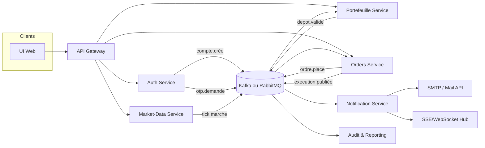

# BrokerX – Plan de transformation Event-Driven (Remise finale)

Objectif : démontrer la migration du monolithe vers des services faiblement couplés orchestrés par événements, avec traçage OpenTelemetry/Jaeger, UX améliorée et double vérification par courriel. Ce document sert de fil conducteur pour la soutenance finale.

## 0. État initial (monolithe) et écart cible
- **Architecture actuelle** : monolithe Spring Boot hexagonal (auth, portefeuille, ordres, marché, notifications) exposé via API Gateway. DB partagée PostgreSQL + cache Redis. Observabilité Prometheus/Grafana en place.
- **Points durs** : couplage fort (bases/transactions partagées), appels synchrones internes, absence de propagation de trace vers les traitements asynchrones, notifications liées au runtime du monolithe.
- **Cible EDA** : services autonomes, base par service, communication par événements (bus Kafka ou RabbitMQ), propagation `traceparent`, réintroduction des flux SSE via un hub dédié, notifications découplées.
- **Critère de réussite** : pour chaque flux métier (signup, dépôt, ordre), un trajet de trace visible dans Jaeger traversant au moins 3 services, et des événements persistés/consommés sans doublon.

### Stack livrée (réelle)
- Services Spring Boot : `auth-service`, `portfolio-service`, `orders-service`, monolithe `api1` (montrer la transition).
- Bus : Kafka (+ Zookeeper), producteurs d’événements `account.created`, `deposit.validated`, `order.placed/order.updated`.
- Bases : un Postgres unique hébergeant 4 bases logiques séparées (`brokerx_monolith`, `brokerx_auth`, `brokerx_portfolio`, `brokerx_orders`).
- Observabilité : Prometheus scrappe tous les services `/actuator/prometheus`, Grafana (Golden Signals), Jaeger OTLP (4317) + UI (16686).
- Gateway : Kong (8081) route vers monolithe et services.

## 1. Vue cible (simple, sans séquence)


## 2. Cas d’utilisation visés (extrait)
```mermaid
usecaseDiagram
  actor Client
  actor "Back-Office" as BackOffice
  rectangle "BrokerX EDA" {
    usecase UC01 as "UC-01 Inscription + Double étape courriel"
    usecase UC02 as "UC-02 Connexion + step-up"
    usecase UC03 as "UC-03 Dépôt virtuel (event-driven)"
    usecase UC04 as "UC-04 Flux marché SSE"
    usecase UC05 as "UC-05 Ordre -> Matching -> Exécution"
    usecase UC06 as "UC-06 Notifications asynchrones"
    usecase UC07 as "UC-07 Audit & Observabilité (OTel/Jaeger)"
  }
  Client --> UC01
  Client --> UC02
  Client --> UC03
  Client --> UC04
  Client --> UC05
  UC05 --> UC06
  UC03 --> UC06
  UC06 --> UC07
  BackOffice --> UC07
```

## 3. Découpage en services
- **auth-service** : identité, OTP/email, tokens, publie `account.created` (Kafka). DB locale `brokerx_auth`.
- **portfolio-service** : dépôts, soldes, réservations; publie `deposit.validated`. DB `brokerx_portfolio`.
- **orders-service** : validation d’ordres, publie `order.placed`, `order.updated`. DB `brokerx_orders`.
- **monolithe api1** : pour compatibilité/transition (profil `monolith`, base `brokerx_monolith`).
- **gateway** : route HTTP, auth, rate-limit; point d’entrée unique vers monolithe + services.
- *(Services cibles non livrés : market-data, notification, audit, matching consumer — à ajouter comme consommateurs Kafka).*

Chaque service expose uniquement ses APIs synchrones minimales (commands/queries) et publie ses faits métier sur le bus pour décrire l’état durable.

### Responsabilité / données / APIs (résumé)
| Service | Données maîtres | Commands REST minimales | Événements produits | Événements consommés |
|---------|-----------------|-------------------------|---------------------|----------------------|
| auth | Accounts, MFA, OTP | `POST /auth/signup`, `POST /auth/verify-email`, `POST /auth/login`, `POST /auth/otp` | `compte.cree`, `otp.demande`, `connexion.audit` | — |
| portfolio | Wallet, TxJournal, Reservations | `POST /deposits`, `GET /wallet/{id}` | `depot.valide`, `reservation.mise_a_jour` | `compte.cree`, `ordre.place`, `execution.cree` |
| orders | Orders, OrderBook, Executions | `POST /orders`, `PUT /orders/{id}`, `DELETE /orders/{id}` | `ordre.place`, `ordre.rejete`, `execution.cree` | `depot.valide`, `reservation.mise_a_jour` |
| market-data | Ticks, Snapshots | `GET /market/stream` (SSE/WS) | `tick.marche` | — |
| notification | Templates, Delivery logs | `GET /notifications/stream` (SSE), `POST /notifications/test` | — | `otp.demande`, `execution.cree`, `ordre.rejete`, `depot.valide`, `tick.marche` |
| audit | Trace/Audit store | `GET /audit/traces/{id}` (lecture) | — | Tous |

## 4. Bus d’événements et topics
| Topic | Producteur | Consommateurs | Charge utile (exemples) | Idempotence |
|-------|------------|---------------|-------------------------|-------------|
| `compte.cree` | auth-service | portfolio, audit | `accountId, email, status, createdAt` | clé = `accountId` |
| `otp.demande` | auth-service | notification | `accountId, email, code, reason` | clé = `accountId:reason` |
| `depot.valide` | portfolio-service | orders, notification, audit | `depositId, accountId, amount, balance` | clé = `depositId` |
| `ordre.place` | orders-service | portfolio, audit | `orderId, accountId, side, qty, reservedCash` | clé = `orderId` |
| `execution.cree` | orders-service | portfolio, notification, audit | `executionId, orderId, fillQty, fillPrice, fees` | clé = `executionId` |
| `ordre.rejete` | orders-service | notification, audit | `orderId, reason, expectedVersion` | clé = `orderId:expectedVersion` |
| `tick.marche` | market-data-service | notification (UI), audit | `symbol, bid, ask, ts, latencyMs` | clé = `symbol:ts` |

> Choisir Kafka (thèmes compactés pour `compte.cree`) ou RabbitMQ (direct/fanout) selon l’outillage disponible. Ajouter un en-tête `traceparent` sur chaque message pour la corrélation OTel.

## 5. Flux clés (sans diagramme de séquence)
- **Onboarding + double étape courriel** : `POST /auth/signup` crée le compte (statut `PENDING`) → événement `compte.cree` → `notification-service` envoie un code par courriel (`otp.demande`). `POST /auth/verify-email` consomme le code, publie `otp.valide` et active le compte. Option : exiger une 2e étape (lien cliquable + OTP) avant la première connexion.
- **Connexion MFA** : `POST /auth/login` -> si step-up requis, publication `otp.demande` et attente du `otp.valide` (réponse 202 + `operationId`), puis issue du JWT une fois validé.
- **Dépôt** : commande synchrone `POST /deposits` → écrit DB `wallet` + publie `depot.valide`. Orders consomme pour débloquer la capacité de trading; notifications informe l’utilisateur.
- **Ordre/Matching** : `POST /orders` crée l’ordre et publie `ordre.place`; portfolio réserve les fonds via `reservation.mise_a_jour`; matching génère `execution.cree`; UI reçoit l’état via SSE et courriel (execution report).
- **Market data** : ticks périodiques publiés sur `tick.marche` puis poussés aux clients via SSE/WebSocket, sans bloquer les autres services.

## 6. Observabilité (OpenTelemetry + Jaeger)
- Activer l’auto-instrumentation OTel (Spring Boot Starter ou Java agent) dans chaque service, exporter en OTLP : `OTEL_EXPORTER_OTLP_ENDPOINT=http://jaeger:4317`, `OTEL_SERVICE_NAME=orders-service`…
- Propager `traceparent`/`baggage` dans les en-têtes HTTP et dans les headers du bus (`traceparent`, `baggage`). En cas de consommation multiple, démarrer une nouvelle span par handler d’événement.
- Jaeger déployé à côté du broker (docker-compose) : services → OTLP gRPC → Jaeger collector → UI Jaeger pour visualiser les spans par flux métier.
- Metrics Prometheus conservées (Golden Signals) avec exemplars (`otel.metric.export.interval`) pour relier métriques ↔ traces.

## 7. UI et UX (web démo)
- Ajouter un écran « Vérification courriel » après le signup ; prévisualiser l’OTP reçu; afficher l’état `PENDING/ACTIVE` en temps réel via SSE `notifications/stream`.
- Consolider un panneau « Journal » unique pour les événements (ordre accepté, exécution, dépôt validé, OTP envoyé) avec la `traceId`.
- Moderniser rapidement (police custom, CTA clairs, erreurs lisibles) sans toucher au backend : page statique servie par la gateway ou un bucket.

## 8. Plan de migration incrémental
1) **Émission d’événements depuis le monolithe** : encapsuler les hooks de domaine pour publier sur Kafka/RabbitMQ (adapter outbox si besoin).  
2) **Dédoubler par service** : déployer auth/portfolio/orders en lisant les mêmes events; router progressivement via l’API Gateway.  
3) **Basculer la persistance** : chaque service prend possession de ses schémas (DB par service) et du code de validation associé.  
4) **Retirer les appels directs** : remplacer les appels internes REST par la consommation des événements et queries read-only via API publiques.  
5) **Observabilité** : vérifier, via Jaeger et Grafana, que chaque flux métier traverse bien plusieurs services avec une trace corrélée.  
6) **Nettoyage monolithe** : ne garder que le strict nécessaire (par ex. mode compatibilité) ou retirer complètement une fois la parité atteinte.

### Critères de sortie par étape
- **1) Publication events** : events persistés (outbox), clé d’idempotence documentée, `traceparent` présent dans les headers, tests d’intégration locaux OK.
- **2) Dédoublement** : services consomment les mêmes topics sans régresser l’API; démonstration A/B via gateway (`/monolith/**` vs `/api/v1/**`).
- **3) Bases séparées** : schémas créés par service; suppression des foreign keys inter-services; réplication des données par events (ex : `compte.cree`).
- **4) Découplage** : aucun appel REST interne bloquant; les commandes sont locales au service; dépendances asynchrones via events/queries lecture seule.
- **5) Observabilité** : traces visibles dans Jaeger pour signup/dépôt/ordre (≥3 services), Golden Signals exposés avec exemplars.
- **6) Nettoyage** : feature toggle de retrait du monolithe, documentation de rollback (re-route vers monolithe via gateway si incident).

## 9. Livrables inclus
- Vue cible et cas d’utilisation (Mermaid) dans ce document.
- Diagrammes PlantUML : classes EDA (`docs/event-driven/class-diagram.puml`), modèle de domaine (`docs/architecture/views/domain-model.puml`), déploiement (`docs/architecture/views/deployment.puml`), use cases (`docs/architecture/views/use-cases.puml`), séquence ordre EDA (`docs/architecture/views/sequence-order.puml`).
- Observabilité OTel/Jaeger : guide `docs/event-driven/observability.md`.
- UI double étape courriel : page statique `src/main/resources/static/index.html`.
