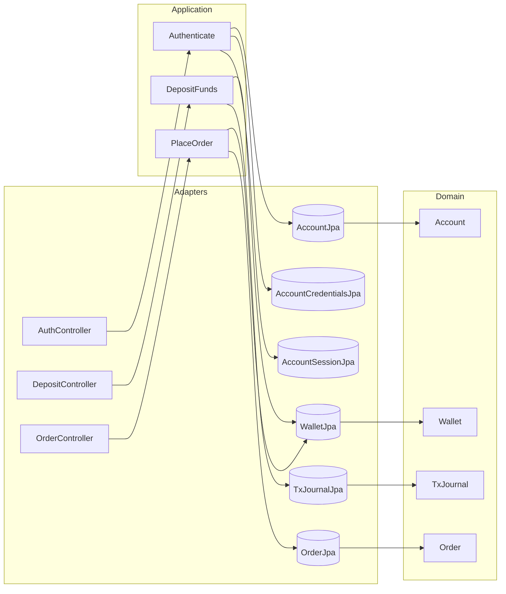
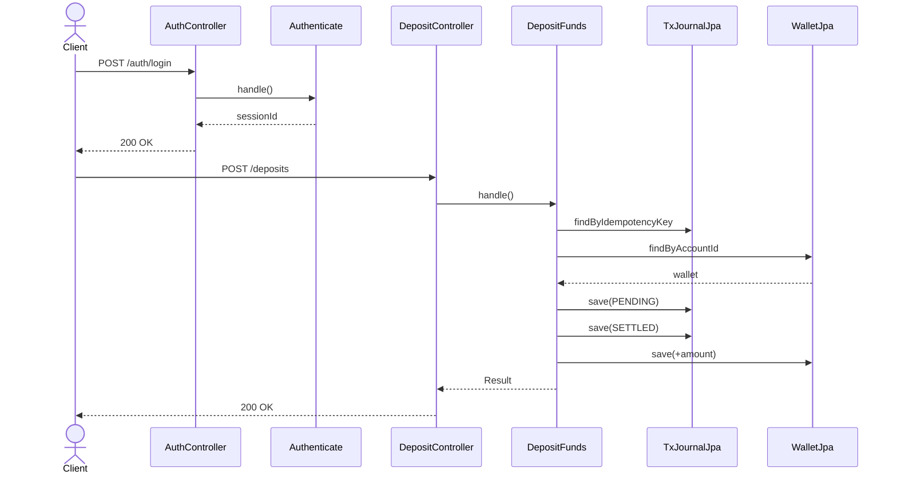

# BrokerX – Documentation d'Architecture (Arc42) – Phase 1

Ce document applique le gabarit Arc42 pour décrire la première phase du projet BrokerX (prototype monolithique). Les informations proviennent du cahier des charges « BrokerX — Plateforme de courtage en ligne ».

## 1. Introduction et objectifs
### Panorama métier
BrokerX est une plateforme de courtage destinée aux investisseurs particuliers. La phase 1 doit livrer un noyau monolithique capable de couvrir le cycle de vie d’un ordre : inscription des clients, financement virtuel du portefeuille, soumission d’ordres, appariement interne et notifications d’exécution.

### Portée de la documentation
Ce document suit le modèle Arc42. Les diagrammes PlantUML se trouvent dans `../views/` (génération PNG : `plantuml *.puml`). Les éléments essentiels sont réunis pour permettre à un nouvel arrivant de comprendre, lancer et déployer le prototype en moins de 30 minutes (voir le `README.md` racine et `../deploy/README.md`).

### Parties prenantes
- **Clients** : investisseurs de détail (web/mobile).
- **Opérations Back-Office** : suivi des règlements et supervision.
- **Conformité & Risque** : application des contrôles KYC/AML et pré-/post-trade.
- **Fournisseurs de données** : diffusion temps réel des cotations simulées.

### Objectifs qualité prioritaires
| Priorité | Objectif | Cible Phase 1 |
|----------|----------|---------------|
| 1 | **Performance** | Latence P95 ≤ 500 ms du dépôt à l’ACK d’ordre ; ≥ 300 ordres/s. |
| 2 | **Disponibilité** | 90 % (monolithique) avec journaux d’audit et récupération rapide. |
| 3 | **Sécurité & conformité** | Authentification MFA, journal immuable, contrôles pré-trade. |
| 4 | **Observabilité** | Logs structurés + métriques (4 Golden Signals) activables. |

## 2. Contraintes
| Contrainte | Description |
|------------|-------------|
| Langages serveur privilégiés | Java, C#, Go, Rust ou C++; Python/JS déconseillés. |
| Architecture | Monolithe évolutif vers hexagonal/microservices. |
| Données | Idempotence sur opérations sensibles (dépôts, ordres). |
| Conformité | KYC/AML, interdiction ventes à découvert non autorisées, audit trail append-only. |

## 3. Contexte et portée
### Diagramme de contexte
```mermaid
flowchart LR
    subgraph Clients
        Trader[Client (Web)]
        BackOffice[Back-Office]
    end
    subgraph Monolithe BrokerX
        Accounts[Client & Comptes]
        Portfolio[Portefeuilles & Positions]
        Orders[Ordres & Appariement]
        Market[Données de marché]
        Notify[Notifications & Confirmations]
        Compliance[Conformité]
    end
    MarketFeed[Fournisseur de données simulé]
    Payment[Service de paiement simulé]

    Trader -->|Inscription / Connexion| Accounts
    Trader -->|Consultation / Dépôts| Portfolio
    Trader -->|Ordres| Orders
    Trader -->|Flux marché| Market
    Trader -->|Notifications| Notify

    BackOffice -->|Supervision| Compliance
    BackOffice -->|Administration comptes| Accounts

    MarketFeed --> Market
    Payment --> Portfolio
    Orders --> Portfolio
    Orders --> Notify
    Compliance --> Notify
```

### Portée fonctionnelle
- Gestion des comptes clients (inscription, MFA, statuts).
- Approvisionnement virtuel et tenue de portefeuille.
- Soumission, modification, annulation et appariement interne des ordres.
- Diffusion de données marché simulées et notifications d’exécution.

### Diagramme de cas d’utilisation (vue Scénarios)
```mermaid
usecaseDiagram
  actor Client
  actor "Service Paiement" as Payment
  rectangle BrokerX {
    usecase UC02 as "UC-02 Authentification"
    usecase UC03 as "UC-03 Dépôt virtuel"
    usecase UC05 as "UC-05 Placer un ordre"
  }
  Client --> UC02
  Client --> UC03
  Client --> UC05
  UC03 --> Payment : confirmation
```

## 4. Architecture de solution
- **Style** : Monolithe modulé suivant une architecture hexagonale (ports/adapters) pour préparer les phases ultérieures.
- **Couches** :
  - Domaine (`Client`, `Portefeuille`, `Ordre`, `ExecutionReport`, `Reservation`).
  - Application/Services orchestrant les cas d’utilisation Must.
  - Infrastructure (REST interne, persistance relationnelle, adaptateurs flux marché/paiement simulé).
- **Flux clef** : ordres → contrôles pré-trade → carnet interne → exécutions → mise à jour portefeuille → notifications.

### Bounded contexts (DDD)
| Contexte | Responsabilites principales | Entites / Aggregats | Interfaces sortantes |
|----------|----------------------------|----------------------|----------------------|
| Client & Comptes | KYC/AML, authentification, gestion MFA, statuts de compte. | Client, Compte, FacteurMFA, Session | Email/SMS, service MFA, audit trail |
| Portefeuilles & Positions | Soldes cash/titres, reservations, journal comptable. | Portefeuille, Position, MouvementComptable, Reservation | Service paiement simule, reglement interne |
| Ordres & Appariement | Controles pre-trade, carnet d'ordres, fills. | Ordre, Carnet, ExecutionReport, ReglePreTrade | Notifications, module portefeuille, flux marche |
| Donnees de marche | Diffusion cotations, snapshots et trades simules. | FluxMarche, Snapshot, Ticker | Fournisseur donnees, WebSocket/SSE |
| Notifications & Confirmations | Ack/Fill/Cancel, email/push, audit. | Notification, Canal, ModeleMessage | Email/SMS, bus de notifications |
| Conformite & Surveillance | Alertes reglementaires, audit immuable, post-trade. | RegleConformite, Alerte, JournalAudit | Back-Office, exports compliance |

### Langage ubiquitaire (extrait)
| Terme | Definition (Phase 1) | Contexte |
|-------|---------------------|----------|
| Compte | Etat KYC, preferences de securite, statut Active/Pending/Suspended. | Client & Comptes |
| Portefeuille | Aggregat cash + positions titres, supporte reservations. | Portefeuilles & Positions |
| Reservation | Blocage temporaire de cash/titres pour un ordre accepte. | Portefeuilles & Positions, Ordres |
| Ordre | Instruction d'achat/vente identifiee par OrderID et clientOrderId. | Ordres & Appariement |
| ExecutionReport | Evenement de resultat (Partial/Fill/Reject) avec prix et quantite. | Ordres & Appariement, Notifications |
| Idempotency key | Identifiant assurant une operation at-most-once (depot, ordre). | Contextes clients |
| Flux marche | Canal temps reel (WS/SSE) publiant top-of-book, trades, OHLC. | Donnees de marche |

### Modele de domaine
Le diagramme de classe `../views/domain-model.puml` illustre les agregats principaux (`CompteClient`, `Portefeuille`, `Ordre`) et leurs relations.

### Vue logique (4+1 – Logical)


### Vue processus (4+1 – Process)


### Vue déploiement (4+1 – Deployment)
```mermaid
graph TB
  subgraph DockerHost
    subgraph Compose
      App[brokerx-app (Spring Boot)]
      DB[(PostgreSQL 16)]
    end
  end
  App -- JDBC --> DB
  App -- health --> |/health| App
  DB -- health --> |pg_isready| DB
```

### Vue développement (4+1 – Development)

```mermaid
flowchart LR
  subgraph adapters-web
    AW1[AuthController]
    AW2[DepositController]
    AW3[OrderController]
    AW4[HealthController]
    AWS1[RequestLoggingFilter]
    AWS2[GlobalExceptionHandler]
  end
  subgraph adapters-persistence
    AP1[entities]
    AP2[repositories]
  end
  subgraph application
    UC1[Authenticate]
    UC2[DepositFunds]
    UC3[PlaceOrder]
  end
  subgraph domain
    DM1[Account]
    DM2[Wallet]
    DM3[Order]
    DM4[TxJournal]
  end
  adapters-web --> application
  application --> adapters-persistence
  adapters-persistence --> domain
```


## 5. Perspectives de qualité
| Qualité | Stratégie Phase 1 |
|---------|-------------------|
| Performance | Contrôles pré-trade en mémoire, transactions ACID, tests de charge ≥ 300 ordres/s. |
| Disponibilité | Déploiement conteneurisé (Docker Compose), sauvegarde régulière des données, scripts de redémarrage rapide. |
| Sécurité | MFA optionnelle, validation d’entrées, gestion des secrets via variables, journaux immuables. |
| Observabilité | Logs JSON, métriques (latence, débit, erreurs, saturation) exposées via endpoint `/metrics`. |

### Tests & Qualité
- Pyramide mise en place : unit (`Authenticate`, `DepositFunds`, `PlaceOrder`), intégration (Testcontainers) et E2E HTTP (`ScenarioE2ETest`).
- Couverture visée ≥80 % sur les services critiques ; les tests d’intégration valident idempotence et contraintes BD.
- Rapport détaillé dans `../tests/test-strategy.md`.

### Sécurité applicative minimale
- Gestion des erreurs centralisée (`GlobalExceptionHandler`) avec codes uniformes et journalisation.
- Validation d’entrées via Bean Validation (`@Valid`, `@NotBlank`, `@Positive`).
- Logs d’accès via un filtre HTTP (`RequestLoggingFilter`).
- Secrets configurables par variables d’environnement (`DB_URL`, `DB_USERNAME`, `DB_PASSWORD`).

## 6. Risques et dettes
| Risque | Impact | Mitigation |
|--------|--------|------------|
| Saturation du carnet (latence > 500 ms) | Rejets tardifs ou pertes d’ordres | Profilage du moteur d’appariement, back-pressure sur entrée.
| Défaillance du fournisseur données simulé | Décisions clients biaisées | Mode dégradé (snapshots périodiques, bannière « données retardées »).
| Vérifications KYC retardées | Blocage inscriptions | Workflow de relance + règles d’expiration automatique (`Pending`). |

## 7. Décisions architecturales
Les décisions structurantes sont consignées dans `../adr/`. (ADR-001 : choix architecture hexagonale vs MVC ; ADR-002 : stratégie de persistance ; ADR-003 : politiques d’idempotence — à rédiger dans une étape ultérieure.)

## 8. Scénarios et cas d’utilisation
### Priorisation MoSCoW
| Identifiant | Titre | Priorité | Justification |
|-------------|-------|----------|---------------|
| UC-01 | Inscription & vérification d’identité | Must | Condition préalable aux activités de trading, exigences KYC/AML. |
| UC-02 | Authentification & MFA | Must | Sécurise l’accès aux comptes et protège les opérations sensibles. |
| UC-03 | Approvisionnement du portefeuille | Must | Garantit des fonds disponibles pour les ordres d’achat. |
| UC-04 | Abonnement aux données de marché | Should | Aide à la décision mais non critique pour exécuter un ordre. |
| UC-05 | Placement d’un ordre (marché/limite) | Must | Cœur métier de la plateforme. |
| UC-06 | Modification / annulation d’un ordre | Must | Offre flexibilité et réduit le risque d’exécution non désirée. |
| UC-07 | Appariement interne & exécution | Must | Transforme les ordres en transactions réelles. |
| UC-08 | Confirmation d’exécution & notifications | Must | Obligation réglementaire de confirmation et traçabilité. |
| UC-09 | Routage vers marchés externes simulés | Could | Prévu pour les phases ultérieures (interopérabilité). |
| UC-10 | Rapports de fin de journée & audit avancé | Could | Valeur ajoutée mais hors périmètre MVP. |
| UC-11 | Détection d’activités suspectes | Won’t (phase 1) | Nécessite une architecture événementielle future. |

### UC Must (scénarios textuels)
#### UC-01 – Inscription & vérification d’identité
- **Acteurs** : Client (principal), service d’email/SMS (secondaire).
- **Préconditions** : aucune.
- **Postconditions (succès)** : compte `Active`, audit enrichi (horodatage, empreinte docs).
- **Flux principal** :
  1. Le client saisit identifiant, mot de passe et données KYC (nom, adresse, date de naissance).
  2. Le système valide les données, crée un compte `Pending` et envoie un OTP ou lien de vérification.
  3. Le client confirme le lien/OTP avant expiration.
  4. Le système active le compte (`Active`), journalise l’événement et notifie le client.
- **Scénarios alternatifs** :
  - A1 : OTP non confirmé → compte reste `Pending`, rappel + expiration automatique.
  - E1 : Email/téléphone déjà utilisés → rejet avec orientation récupération de compte.
  - E2 : Données KYC invalides → rejet explicite et instructions.

#### UC-02 – Authentification & MFA
- **Préconditions** : compte `Active`.
- **Postconditions (succès)** : session établie, jeton de connexion, audit (IP, device).
- **Flux principal** :
  1. Le client saisit identifiant/mot de passe.
  2. Le système vérifie les crédentiels et applique anti-brute-force / réputation IP.
  3. Si MFA requise, un OTP (TOTP/SMS/WebAuthn) est envoyé.
  4. Le client fournit l’OTP valide.
  5. Le système délivre le jeton de session et enregistre l’authentification.
- **Scénarios alternatifs** :
  - A1 : Appareil de confiance → step-up MFA sollicité uniquement pour actions sensibles.
  - E1 : Trois OTP erronés → verrouillage temporaire.
  - E2 : Compte suspendu → accès refusé, contact support.

#### UC-03 – Approvisionnement du portefeuille (dépôt virtuel)
- **Préconditions** : compte `Active`, portefeuille initialisé.
- **Postconditions (succès)** : solde créditeur, écriture comptable append-only, notification.
- **Flux principal** :
  1. Le client saisit montant et identifiant idempotent (clientRequestId).
  2. Le système vérifie les limites (min/max, anti-fraude) et crée une transaction `Pending`.
  3. Le service de paiement simulé confirme (`Settled`).
  4. Le système crédite le portefeuille, journalise le mouvement et notifie le client.
- **Scénarios alternatifs** :
  - A1 : Confirmation asynchrone → reste `Pending` jusqu’à réception, puis crédit.
  - E1 : Paiement rejeté → transaction `Failed`, message explicite.
  - E2 : Re-soumission avec même idempotency key → renvoi du résultat initial.

#### UC-05 – Placement d’un ordre (marché/limite)
- **Préconditions** : session valide, portefeuille créditeur, instrument éligible.
- **Postconditions (succès)** : ordre `Accepted/Working`, réservations de fonds ou titres mises à jour.
- **Flux principal** :
  1. Le client fournit symbole, sens, type (marché/limite), quantité, prix (si limite), durée (DAY/IOC/FOK) et `clientOrderId`.
  2. Le système normalise la requête, horodate en UTC et persiste pour audit.
  3. Contrôles pré-trade : pouvoir d’achat/marge, bandes de prix, interdictions short-sell, limites utilisateur, cohérence.
  4. En cas de succès, le système réserve les montants nécessaires, attribue un `OrderID` et envoie un ACK.
  5. L’ordre est injecté dans le moteur d’appariement interne.
- **Scénarios alternatifs** :
  - A1 : Ordre marché → pas de prix requis, routage immédiat.
  - A2 : IOC/FOK → logique spécifique dans l’étape d’appariement.
  - E1 : Pouvoir d’achat insuffisant → rejet motivé.
  - E2 : Violation bande de prix / tick size → rejet immédiat.
  - E3 : Duplication `clientOrderId` → renvoi de la réponse initiale (idempotence).

#### UC-06 – Modification / annulation d’un ordre
- **Préconditions** : ordre existant, non entièrement exécuté.
- **Flux principal** :
  1. Le client émet une requête Cancel ou Replace (quantité/prix).
  2. Le système verrouille l’ordre (optimiste/pessimiste) et vérifie l’état courant.
  3. Pour Replace, les contrôles pré-trade sont rejoués ; pour Cancel, l’ordre est retiré.
  4. Le système renvoie Cancel/Replace ACK et met à jour les réservations.
- **Scénarios alternatifs** :
  - A1 : Exécution partielle concurrente → seule la quantité résiduelle est modifiable.
  - E1 : Ordre déjà exécuté/annulé → rejet avec état courant.
  - E2 : Conflit de version → invitation à rejouer avec la dernière révision.

#### UC-07 – Appariement interne & exécution
- **Préconditions** : carnet maintenu (priorité prix/temps).
- **Flux principal** :
  1. Le moteur insère l’ordre entrant dans le carnet approprié (achat/vente).
  2. Il recherche les contreparties prioritaires et génère des exécutions (fills) partielles ou totales.
  3. Le système met à jour les quantités restantes et publie des `ExecutionReport`.
  4. Mise à jour du top-of-book et diffusion aux abonnés marché.
- **Scénarios alternatifs** :
  - A1 : Ordre marché sans liquidité → exécution partielle, reliquat reste `Working` ou annulé (IOC/FOK).
  - E1 : Incohérence détectée dans le carnet → rollback local et alerte opérations.

#### UC-08 – Confirmation d’exécution & notifications
- **Préconditions** : `ExecutionReport` généré.
- **Flux principal** :
  1. Le système met à jour l’état de l’ordre (Partial/Filled/Rejected).
  2. Il crée une confirmation avec détails (prix, quantité, frais) et journalise l’audit.
  3. Notifie le client (UI push + email de fallback).
- **Scénarios alternatifs** :
  - A1 : Agrégation de multiples fills avant notification.
  - E1 : Notification temps réel échoue → retry puis email de secours.

---

Les sections suivantes (notamment la modélisation détaillée, vues 4+1 et ADR) seront complétées dans les étapes ultérieures.
# Stratégie de tests – Phase 1

| Niveau | Objectif | Couverture / artefacts |
|--------|----------|------------------------|
| **Unit** | Valider les règles métier critiques sans dépendances externes. | Tests Mockito sur `Authenticate`, `DepositFunds`, `PlaceOrder` (`src/test/java/com/brokerx/unit`). |
| **Intégration** | Vérifier la persistance, transactions et idempotence contre PostgreSQL (Testcontainers). | `AuthIntegrationTest`, `DepositIntegrationTest`, `OrderIntegrationTest`. |
| **E2E** | Démontrer le scénario login → dépôt → ordre via HTTP réel. | `ScenarioE2ETest` (profil `test`, port aléatoire). |

- Couverture visée : ≥80 % sur les services `Authenticate`, `DepositFunds`, `PlaceOrder` (mesurée via JaCoCo lors du rapport final).
- Génération automatique : `mvn verify` (JDK 21 recommandé pour la compatibilité JaCoCo). Rapport HTML : `projet-phase1/target/site/jacoco/index.html`.
- Les tests d’intégration utilisent `jdbc:tc:postgresql:16:///testdb` pour rejouer les migrations Flyway et vérifier les contraintes (FK, CHECK, unique).
- Le test E2E orchestre l’appel des endpoints REST et sert de démonstration automatique du scénario de phase 1.
- Pour les futures phases, ajouter des tests de sécurité (JWT expiré, MFA failure) et des tests de performance ciblés sur les contrôles pré-trade.
# Déploiement & exploitation – Phase 1

## Pré-requis
- Docker & Docker Compose
- JDK 21 (pour exécution locale sans conteneur)

## Lancer la stack
```bash
cd projet-phase1
./scripts/deploy.sh
```
Ce script :
1. Construit l'image multi-stage définie dans `Dockerfile`.
2. Lance `docker compose` avec l'application (`app`) et PostgreSQL (`db`).
3. Recrée les services en cas de mise à jour (rollback simple : `docker compose down && ./scripts/deploy.sh`).

## Vérifier la santé
- Base de données : healthcheck `pg_isready` intégré au service `db`.
- Application : healthcheck `http://localhost:8080/health` (exposé via `HealthController`).
- Logs : `docker compose logs -f app` ou `docker compose logs -f db`.

## Scénario de smoke test
1. `curl -X POST http://localhost:8080/internal/auth/login ...`
2. `curl -X POST http://localhost:8080/internal/deposits ...`
3. `curl -X POST http://localhost:8080/internal/orders ...`
Les commandes sont documentées dans la section démonstration.

## Environment variables
| Variable | Description | Par défaut |
|----------|-------------|------------|
| `DB_URL` | URL JDBC PostgreSQL | `jdbc:postgresql://db:5432/brokerx` (dans compose) |
| `DB_USERNAME` | Utilisateur BD | `brokerx` |
| `DB_PASSWORD` | Mot de passe BD | `brokerx` |

Pour override en production : `docker compose --env-file prod.env up -d`.
